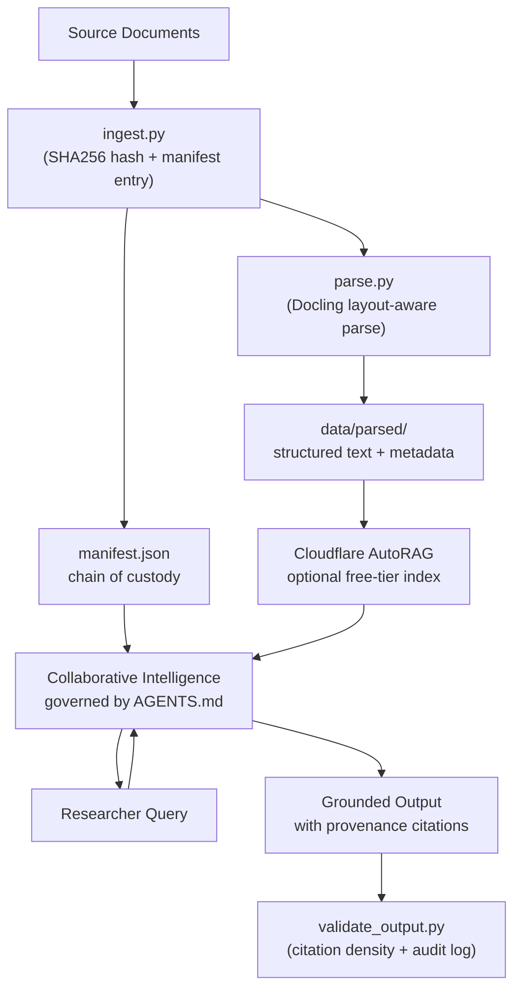

# Vibe Research

**Provided by** the [Medical Policy Applied Research Team (MPART)](https://github.com/illinoismpart/.github/blob/main/README.md) at the **University of Illinois Springfield**.  
**Collaboratively Built by** Dr. Ben Barnard, Dr. Ty Dooley, Frank Sun, and Oladimeji Adaramewa

---

**"Vibe coding" for academics** is **domain-led agency**: you bring the questions and the expertise; the AI brings the capacity to work through massive datasets without burying you in mechanical labor. This template gives you a governed pipeline — ingest, parse, validate — that keeps every AI-generated claim traceable to a real, hashed source document. You stay in charge. The agent stays grounded.

> *Aligned with Human-Centered AI (Shneiderman): high human control + high automation, together.*

---

## Quick Start

Three commands and you're running.

```bash
# 1. Ingest — hash a source document and register it in the chain of custody
python scripts/ingest.py data/raw/your-document.pdf

# 2. Parse — verify integrity and extract structured content with layout labels
python scripts/parse.py data/raw/your-document.pdf

# 3. Validate — check an AI response for citation coverage and grounded claims
python scripts/validate_output.py --input ai_response.txt --draft
```

> **First time?** See [Setup](#setup) below to install dependencies and fork the repo.  
> **Writing prompts?** Start with [`prompts/getting_started.md`](prompts/getting_started.md).

---

## Research Mode vs. Compliance Mode

The pipeline has two gears. Use the right one for where you are in the process.

| | Research Mode | Compliance Mode |
|---|---|---|
| **When to use** | Discovery, drafting, exploring the corpus | Final outputs, pre-submission, peer review prep |
| **Citation threshold** | 70% — introductory prose is allowed | 100% — every factual claim needs a hash |
| **Missing citations** | Flagged with `Tip:` hints, never blocks | Hard exit until resolved |
| **GPG signing** | Optional — warning if unsigned | Required — exits 1 if unsigned |
| **Flag** | default (no flag needed) | `--mode compliance` |
| **Draft-safe flag** | `--draft` — shows all tips, always exits 0 | — |

```bash
# Research Mode — explore, draft, iterate
python scripts/validate_output.py --input draft.txt --draft

# Compliance Mode — final check before submitting
python scripts/validate_output.py --input final.txt --mode compliance
```

---

## Scope and Responsibility

This pipeline enforces **structural integrity**, not analytical validity. When an output passes Compliance Mode, it means every cited document is traceable to a specific, hashed, ingested file; every factual sentence carries a manifest-backed SHA256; and the chain of custody has not been broken. It does not mean the interpretation of those documents is correct, that the cited passages actually support the claims made, or that the work is ready for submission without peer review. Regulatory conclusions, policy interpretations, and disciplinary judgments cannot be delegated to a pipeline. The researcher remains the sole authority for those. These guardrails are designed to eliminate the mechanical failure modes — hallucinated citations, untracked document versions, silent file modifications — that make AI-assisted research hard to defend. They amplify professional judgment; they do not replace it.

> The pipeline handles extraneous load (Sweller, 1988). You handle the rest.

---

## Why this pipeline?

Working with thousands of documents — say, 16,000+ Medicaid State Plan Amendments — creates a real cognitive trap: the researcher spends more time on *formatting, finding, and verifying files* than on *domain-specific analysis*. **Cognitive Load Theory** (Sweller, 1988) names this "extraneous load" — effort that does not advance insight. This pipeline automates ingestion, hashing, parsing, and provenance tracking so your attention goes where it matters: policy evolution, eligibility criteria, cross-plan comparison.

You aren't being lazy. You're allocating cognitive capacity to what only you can do.

---

## Privacy, HIPAA, and PII

> **Read this before ingesting any documents.**

Medicaid State Plan Amendments are generally **public administrative records** and do not contain individual patient data. However, supplemental attachments, exhibits, or related data files **may** contain Protected Health Information (PHI) or Personally Identifiable Information (PII). Before running this pipeline:

- **Do not commit sensitive data.** `data/raw/` and `data/parsed/` are gitignored but are not encrypted on disk.
- **Cloud services and BAAs.** Confirm a **Business Associate Agreement (BAA)** is in place before uploading PHI to Cloudflare AutoRAG or any other service. The free tier is not automatically HIPAA-covered.
- **Consult your IRB and compliance office** if any documents are subject to HIPAA Safe Harbor or Expert Determination standards.
- **Credentials.** Copy `.env.example` to `.env` and add API keys there. `.env` is gitignored. Never hard-code credentials in scripts.

The pipeline includes a built-in PII smoke-test (`scripts/pii_sniff.py`). Documents with high-confidence identifiers (SSN, MBI, etc.) are automatically quarantined to `data/quarantine/` before parsing begins.

---

## Setup

**Prerequisites:** Python 3.10+ and Git. Cloudflare account is optional (free tier AutoRAG for retrieval).

```bash
# Fork or clone
git clone https://github.com/illinoismpart/vibe_research.git
cd vibe_research

# Create a virtual environment
python3 -m venv .venv
source .venv/bin/activate   # Windows: .venv\Scripts\activate

# Install dependencies
pip install -r requirements.txt
```

Then:

1. Open `AGENTS.md` and fill in the **Project Identity** section — what your research is, who it serves, what questions are in scope. This is what the AI reads as its constitution.
2. Place source documents in `data/raw/`.
3. Run the three Quick Start commands above.
4. Use `prompts/getting_started.md` for your first research prompts.

---

## Pipeline Overview



---

## Customizing for Your Project

- **`AGENTS.md`** — The main lever. Fill in Project Identity and adjust allowed/forbidden behaviors for your discipline. The agent reads this file as its constitution.
- **Scripts** — `ingest.py` and `parse.py` are minimal by design. Extend them (batch ingestion, different parsers, Cloudflare upload) while keeping the same contract: manifest = chain of custody.
- **Prompts** — Store your research questions in `prompts/` so you and your agents share a reference. Start with `prompts/getting_started.md`.

---

## Deep Rigor

These features exist for researchers who need the highest level of auditability. They are not required for day-to-day use.

### GPG Manifest Signing

GPG signing attaches your cryptographic identity to `manifest.json`, making it possible for anyone to verify not just *what* was ingested but *by whom*. It is required in Compliance Mode.

```bash
# Sign the manifest after ingestion
python scripts/ingest.py data/raw/myfile.pdf --sign

# Or sign manually
gpg --detach-sign --armor data/manifest.json
```

If GPG is not installed, `ingest.py` will tell you how to get it and continue without signing. The SHA256 `manifest.lock` still provides content integrity in the meantime.

> Install GPG: `brew install gnupg` (macOS) · `sudo apt install gnupg` (Linux)

### Citation Density and POS Heuristics

`validate_output.py` classifies sentences as "factual claims" using lightweight part-of-speech heuristics — no heavy NLP dependencies required:

- **NNP** — Capitalized proper nouns mid-sentence (e.g., "Illinois," "CMS," "Medicaid")
- **CD** — Cardinal numbers and percentages (e.g., "five states," "2023," "40%")
- **JJR/JJS** — Comparatives and superlatives (e.g., "higher," "most restrictive")

Any claim sentence missing a manifest SHA256 receives a `Tip:` hint naming the triggering token and suggesting which manifest document to look up.

### Git-Bind (Manifest ↔ Commit Anchor)

Every manifest entry automatically records the current Git commit hash. This binds your data state to your code state: if repository history is rewritten or the manifest is tampered with, the commit-to-hash link becomes auditable in the Git log.

### FAIR Data Principles and RO-Crate

The manifest implements [FAIR Data Principles](https://www.go-fair.org/fair-principles/) (Findable, Accessible, Interoperable, Reusable) and a lightweight [RO-Crate](https://www.researchobject.org/ro-crate/) structure. Each document is identified by SHA256, timestamped, and linked to its source path — enough metadata to make the research object reproducible and reusable by others.

### Audit Log

Every `validate_output.py` run appends a row to `data/audit_log.csv`:

```
Timestamp, Git_Commit, Mode, Citation_Score, Status
```

The log is tracked in Git — it is the "black box" of your research process and part of what a reviewer will see.

---

## Links

- [Docling](https://github.com/DS4SD/docling) — Layout-aware document parsing.
- [Cloudflare Workers AI / AutoRAG](https://developers.cloudflare.com/workers-ai/) — Free-tier retrieval over your corpus.
- [`scripts/README.md`](scripts/README.md) — Detailed usage for all three scripts.
- [`prompts/getting_started.md`](prompts/getting_started.md) — Three starter prompts to test your pipeline.

### Foundational References

- **Shneiderman, B.** Human-Centered AI (HCAI). *AIS Transactions on HCI.* — High human control + high automation. [AIS THCI](https://aisel.aisnet.org/thci/)
- **Daugherty, P. R., & Wilson, H. J. (2018).** Collaborative Intelligence: Humans and AI Are Joining Forces. *Harvard Business Review.* — Human–AI teaming; "synthetic intern" metaphor.
- **Sweller, J. (1988).** Cognitive load during problem solving. *Cognitive Science.* — Extraneous vs. germane load.
- **FAIR Guiding Principles.** [GO FAIR](https://www.go-fair.org/fair-principles/)
- **RO-Crate.** [researchobject.org](https://www.researchobject.org/ro-crate/)

---

## License

Use and adapt this template for your research. If you build something others can reuse, consider sharing it back.
