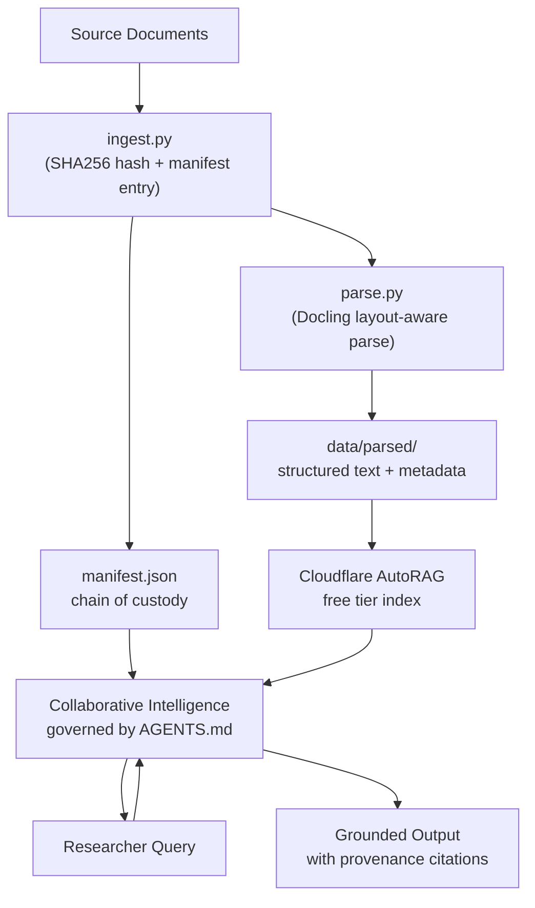

# Vibe Research

**Provided by** the Medical Policy Applied Research Team (MPART)at the **University of Illinois Springfield**.  
**Built by** Dr. Ty Dooley and Dr. Ben Barnard.

---

A starter repository for academics who want to use **"vibe coding"** as a mechanism for data collection and inquiry at scale. Fork this template, add your documents, customize the guardrails, and let **collaborative intelligence** agents (Daugherty & Wilson, 2018)—*synthetic interns*—work as research assistants while you stay in charge.

**Framework alignment:** This template is designed around **Human-Centered AI (HCAI)** (Shneiderman): **high human control** and **high automation** together. You steer; the agent executes. The barrier to entry has collapsed for the terminally curious expert.

---

## What is "vibe coding" for academics?

"Vibe coding" is often dismissed as undisciplined. We argue the opposite: it represents **domain-led agency**. You bring the questions and the rigor; the AI brings the capacity to manage massive datasets and repetitive tasks. The result is not less discipline, it's more. Researchers steer the inquiry instead of being buried by the data and labor burden.

This repo gives you:

- **AGENTS.md** — A plain-English "constitution" that collaborative intelligence agents (Copilot, Cursor, Claude, etc.) follow. It enforces data provenance, chain of custody, and citation so that inquiry stays grounded and auditable, in line with HCAI (human in control).
- **A minimal pipeline** — Ingest documents with SHA256 hashes, parse them with layout-aware tools (Docling), and keep a manifest so every claim can be traced back to a specific version of a source. The manifest implements **FAIR Data Principles** and a **lightweight RO-Crate** (Research Object Crate) structure for data integrity and reuse.
- **Room to grow** — Add Cloudflare AutoRAG (free tier) for retrieval, or other tools. The template stays small; you extend it for your domain.

---

## Pipeline overview



1. **Ingest** — Run `ingest.py` on each source file. It hashes the file and adds an entry to `data/manifest.json`.
2. **Parse** — Run `parse.py` on ingested files. It checks the manifest (chain of custody), then uses Docling to produce layout-aware structured output in `data/parsed/`.
3. **Query** — (Optional) Index parsed content with Cloudflare AutoRAG so you can ask questions over your corpus. The agent answers using only ingested data and cites manifest + location.
4. **Steer** — You ask questions; the agent returns grounded answers with provenance. AGENTS.md keeps it from hallucinating or citing unsourced material.

---

## Why this pipeline?

Working with thousands of documents (e.g., 16,000+ Medicaid State Plan Amendments) creates a real risk: the researcher spends more time on *formatting, finding, and verifying files* than on *domain-specific analysis*. **Cognitive Load Theory** (Sweller, 1988) distinguishes **germane load** (thinking that advances learning and insight—e.g., comparing policy across states) from **extraneous load** (effort that does not—e.g., manually opening and normalizing PDFs). This pipeline is designed to **reduce extraneous cognitive load**. Ingestion, hashing, parsing, and provenance tracking are automated so that you can focus your limited cognitive capacity on what you care about: policy evolution, eligibility criteria, cross-plan comparison. You aren't being lazy; you're allocating attention where it matters.

---

## Prerequisites

- **Python 3.10+** — For running the ingestion and parsing scripts.
- **Cloudflare account** (optional) — Free tier is enough for AutoRAG if you want retrieval over your corpus. See [Cloudflare Workers AI](https://developers.cloudflare.com/workers-ai/) and docs for RAG/indexing.

---

## Quick start (5 steps)

1. **Fork or clone this repo**  
   ```bash
   git clone https://github.com/illinoismpart/vibe_research.git
   cd vibe_research
   ```

2. **Create a virtual environment and install dependencies**  
   ```bash
   python3 -m venv .venv
   source .venv/bin/activate   # On Windows: .venv\Scripts\activate
   pip install -r requirements.txt
   ```

3. **Customize AGENTS.md**  
   Open `AGENTS.md` and fill in the **Project Identity** section (what your research is, who it serves, what questions are in scope). Edit other sections as needed for your discipline. This file is what AI agents will use as their guardrails.

4. **Add your source documents**  
   Place your files (PDFs, etc.) in `data/raw/`. Do not commit large or sensitive data if your repo is public—use `.gitignore` (already ignores `data/raw/` and `data/parsed/`).

5. **Ingest and parse**  
   From the repo root:
   ```bash
   python scripts/ingest.py data/raw/your-document.pdf
   python scripts/parse.py data/raw/your-document.pdf
   ```
   See `scripts/README.md` for more detail.

After that, you can point your AI assistant at this repo. When it reads AGENTS.md, it will restrict itself to manifest-backed sources and cite provenance. Use `prompts/example_inquiry.md` for ideas on how to phrase research questions.

---

## Customizing for your own project

- **AGENTS.md** — This is the main lever. Change the project identity, allowed/forbidden behaviors, and output standards to match your field. The customization instructions at the bottom of AGENTS.md spell out what to replace.
- **Scripts** — `ingest.py` and `parse.py` are minimal. You can extend them (e.g., batch ingestion, different parsers, Cloudflare upload) while keeping the same contract: manifest = chain of custody.
- **Prompts** — Store your research questions and example prompts in `prompts/` so you and your agents have a shared reference.

---

## Links

- [Docling](https://github.com/DS4SD/docling) — Layout-aware document parsing.
- [Cloudflare Workers AI / AutoRAG](https://developers.cloudflare.com/workers-ai/) — Free-tier options for indexing and querying your corpus.
- This template was created by **MPART (Medical Policy Applied Research Team)** at the University of Illinois Springfield—Dr. Ty Dooley and Dr. Ben Barnard—for inquiry into Medicaid State Plan Amendments and policy evolution at scale.

### Foundational references

- **Shneiderman, B.** Human-Centered AI (HCAI). *AIS Transactions on Human-Computer Interaction.* High human control + high automation. [AIS THCI](https://aisel.aisnet.org/thci/).
- **Daugherty, P. R., & Wilson, H. J. (2018).** *Collaborative Intelligence: Humans and AI Are Joining Forces.* Harvard Business Review. — Human–AI teaming; "synthetic intern" metaphor.
- **FAIR Guiding Principles.** [GO FAIR](https://www.go-fair.org/fair-principles/). — Findable, Accessible, Interoperable, Reusable data; our manifest aligns with these goals.
- **RO-Crate (Research Object Crate).** [RO-Crate](https://www.researchobject.org/ro-crate/). — Lightweight packaging of research data with metadata; our manifest is a minimal implementation.
- **Sweller, J. (1988).** Cognitive load during problem solving. *Cognitive Science.* — Extraneous vs. germane load; rationale for automating document handling so researchers focus on domain analysis.

---

## License

Use and adapt this template for your research. If you build something others can reuse, consider sharing it back.
